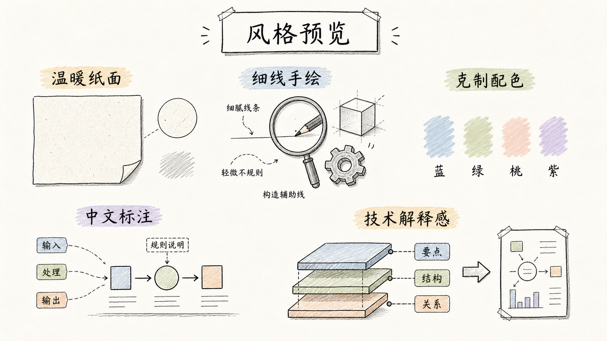

# Handdrawn Tech Illustrations

一个用于生成中文手绘技术配图的 Codex Skill。

它适合把技术文章、产品笔记、截图、大纲或粗略想法，变成正文配图、概念解释图、微信公众号封面和小红书/Rednote 封面。


## 这个 Skill 做什么

- 把中文技术内容生成清晰的手绘风格栅格图。
- 支持正文配图、文章封面、微信公众号封面、小红书/Rednote 封面。
- 使用 Codex 内置生图模型直接生成最终图片。
- 不强制固定输出目录：用户指定路径就放到指定位置，否则保留模型返回路径并明确报告。
- 主要负责生成图片；需要时可以顺手裁剪、缩放，或做一张多图预览。

## 效果预览

这个 skill 专注于一种画面气质：干净、克制、中文可读的手绘技术解释图。

- 接近白色的温暖纸面；
- 细铅笔/墨线手绘质感；
- 克制的浅蓝、鼠尾草绿、浅桃、浅紫标记色；
- 可读的简体中文标注；
- 信息密度适中，像技术作者画给读者看的解释图。

同一种画面气质下，可以根据内容选择不同表达方式：

| 注释图 | 对比图 |
| --- | --- |
|  |  |

| 证据图 / 截图解释 | 风格元素 |
| --- | --- |
|  |  |

它不强制每张图都变成流程图或隐喻图。更重要的是让图服务内容：该保留截图证据时保留截图，该讲结构时画结构，该做封面钩子时就减少细节。

## 输出模式

| 模式 | 建议比例 | 用途 |
| --- | --- | --- |
| 正文配图 | `16:9` | 技术文章正文图、概念解释图 |
| 文章 / 微信长封面 | `21:9` | 博客头图、公众号主封面 |
| 微信方形封面 | `1:1` | 公众号配套方形封面 |
| 小红书 / Rednote 封面 | `3:4` | 竖版社交平台封面 |
| Shot list only | 无 | 只规划图点，不生成图片 |

## 安装

复制这句话给 Codex：

```text
请帮我安装 handdrawn-tech-illustrations 技能，GitHub 地址是：https://github.com/ningzimu/handdrawn-tech-illustrations
```

## 使用示例

```text
使用 handdrawn-tech-illustrations，为这篇中文技术文章生成一张 16:9 正文配图。
```

```text
使用 handdrawn-tech-illustrations，基于这个大纲生成公众号 21:9 封面和 1:1 方形封面。
```

```text
使用 handdrawn-tech-illustrations，把这份包含截图的产品笔记画成一张技术解释图。
```

只规划图点，不生成图片：

```text
使用 handdrawn-tech-illustrations，为这篇文章生成 shot list，暂时不要生图。
```

## 仓库结构

```text
.
├── agents/
│   └── openai.yaml
├── assets/
│   ├── readme-overview.png
│   ├── readme-preview-annotated.png
│   ├── readme-preview-comparison.png
│   ├── readme-preview-evidence.png
│   └── readme-style-preview.png
├── skills/
│   └── handdrawn-tech-illustrations/
│       ├── SKILL.md
│       ├── assets/
│       │   └── theme-tokens.json
│       └── references/
│           ├── content-planning.md
│           ├── platform-specs.md
│           ├── production-workflow.md
│           ├── prompt-patterns.md
│           ├── qa-checklist.md
│           └── style-dna.md
└── README.md
```

## 说明

- 仓库根目录放 GitHub 相关文件和展示资源。
- skill 源文件位于 `skills/handdrawn-tech-illustrations/`。
- README 图片位于 `assets/`，用于展示这个 skill 的用途和风格。
- 这个 skill 生成栅格图片，不生成可编辑文档包、版式模板或卡片系统。
